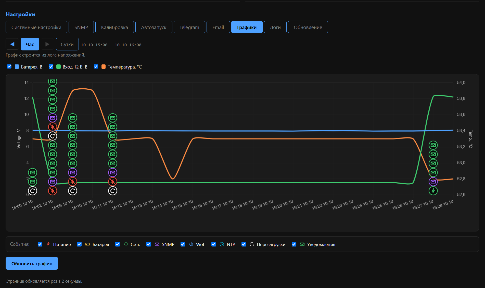
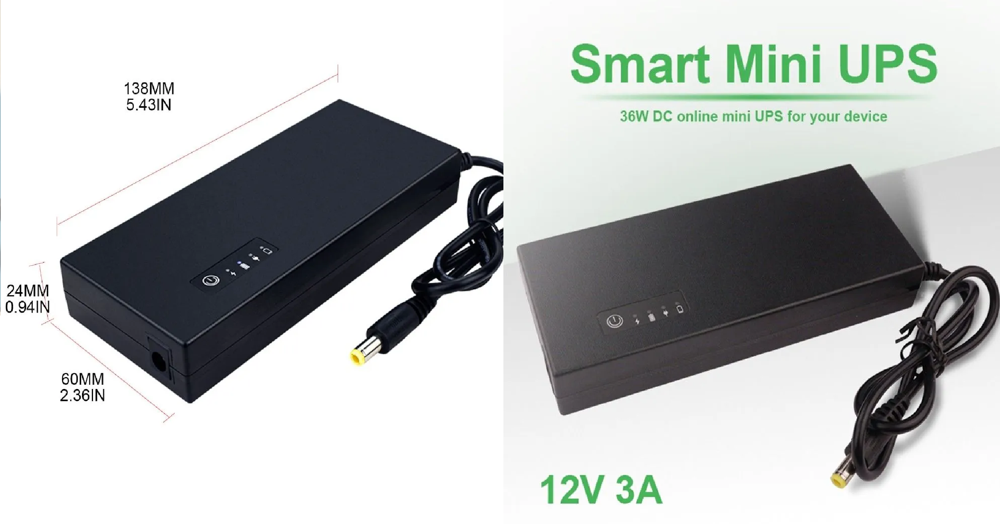
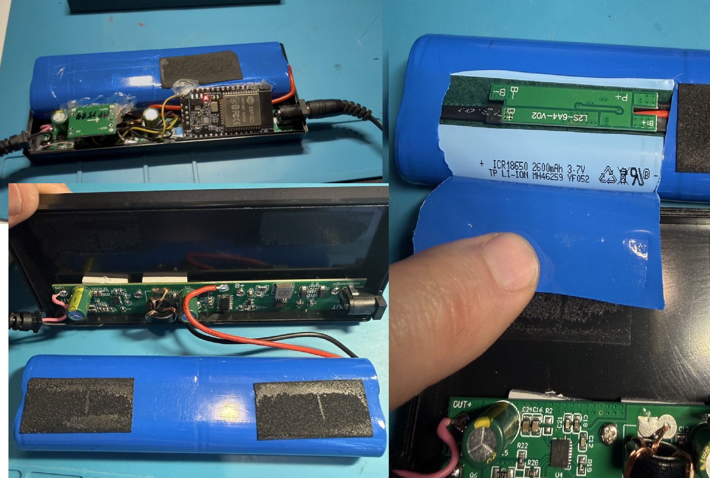
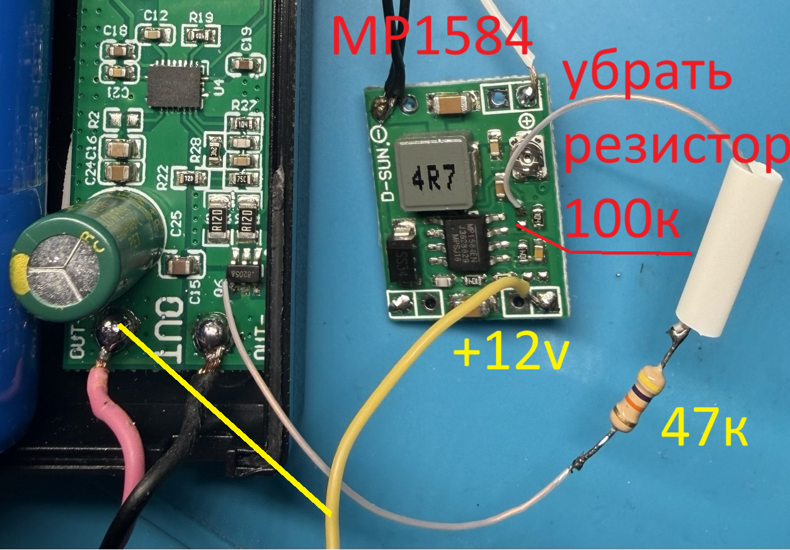
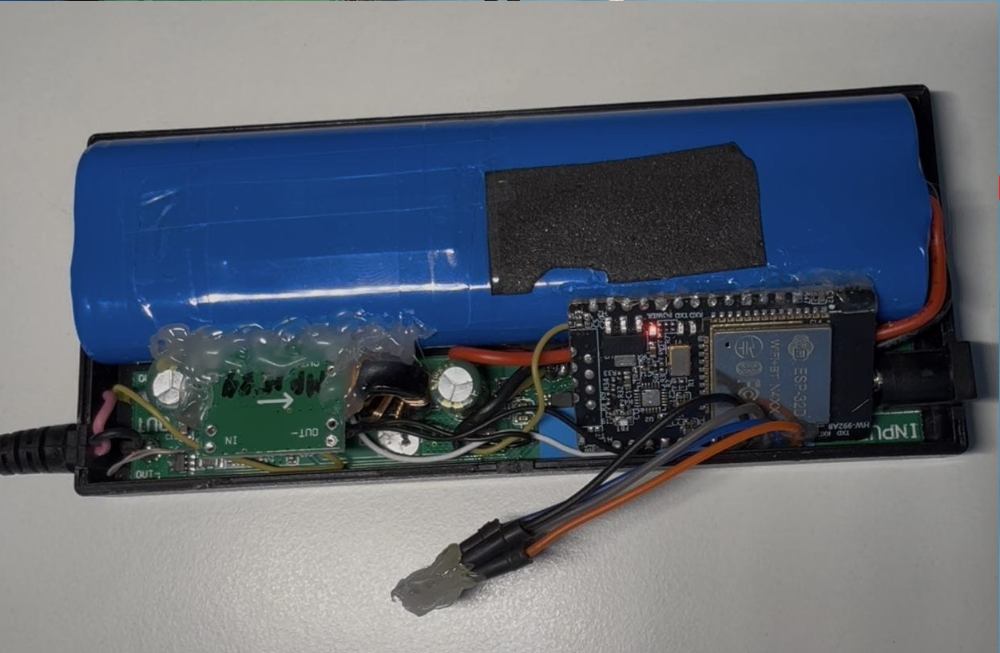
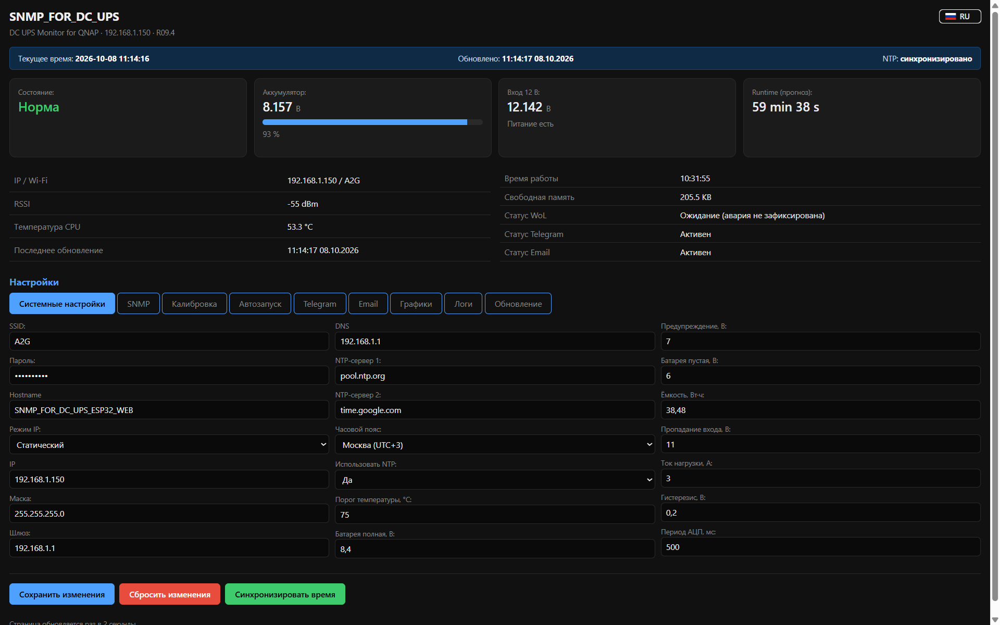
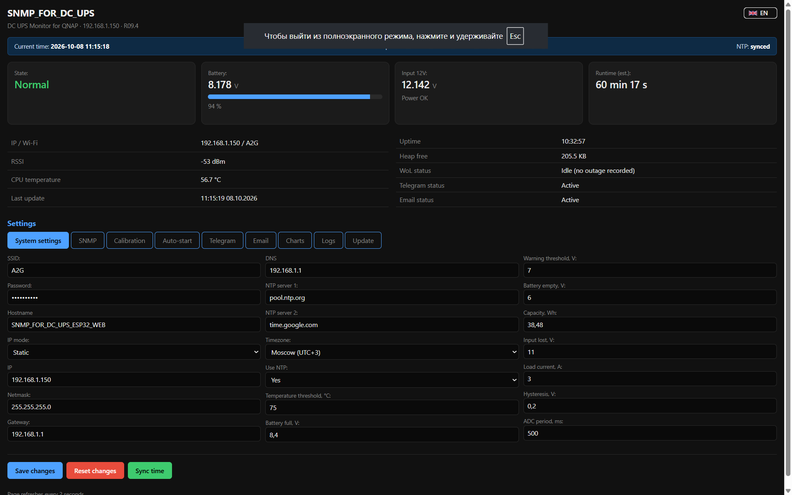

# SNMP_FOR_DC_UPS

> Готовый SNMP-агент, веб-дашборд и уведомления для **ИБП для роутера** (DC UPS 12 В),
> который защищает QNAP NAS от некорректного выключения при пропадании сети.

[]()
[]()
[](LICENSE)
[](https://youtu.be/xlYLajyg3V0)

🎬 **Видео по проекту:** [Основное видео](https://youtu.be/xlYLajyg3V0) · [Плейлист](https://www.youtube.com/playlist?list=PLHQahsdlvSlE)

---

## 🚀 Быстрый старт (5 минут)

**Что это?** Прошивка для платы ESP32, которая превращает обычный
**ИБП для роутера** (DC UPS 12 В, 38,48 Вт·ч, сборка 2S2P Li-ion 18650,
разъём DC 5.5 × 2.1 мм) в сетевой SNMP-ИБП. Устройство измеряет
напряжение аккумулятора и входа, отдаёт данные по SNMP, чтобы сервер
QNAP NAS корректно выключался при аварии питания, и присылает
уведомления в Telegram/Email.

**Что нужно:**

| Компонент | Где взять |
|-----------|-----------|
| ИБП для роутера (38,48 Вт·ч, 2S2P) | AliExpress, Ozon |
| ESP32 Dev Module (любая плата на классическом ESP32, 4 МБ Flash) | AliExpress, Ozon |
| **DC-DC преобразователь 12 В → 5 В** (MP1584EN или аналог) | AliExpress, Ozon |
| 2 × резистор 4,6 кОм (1%) | для делителей напряжения |
| 2 × резистор 47 кОм (1%) | для делителей напряжения |
| 1 × резистор 47 кОм (1%) | для управления DC-DC от затвора мосфета |

**Что сделать (краткая версия):**

1. Установить **Arduino IDE 1.8.19** и **ESP32 core 2.0.17** через Boards Manager.
2. Установить библиотеки: **ElegantOTA**, **SNMP_Agent**, **UniversalTelegramBot 1.3.0**, **ArduinoJson 6.21.5**.
3. **Заполнить `config.h`** — обязательно указать **SSID и пароль Wi-Fi**, иначе устройство не подключится к сети и веб-дашборд будет недоступен. Также задать OTA-пароль (см. предупреждение ниже).
4. Создать файл `custom_ups.csv` в папке с ESP32 core (путь ниже).
5. Дописать 3 строки в `boards.txt` (путь ниже).
6. Перезапустить Arduino IDE, выбрать плату **ESP32 Dev Module** и схему **Custom UPS**.
7. Открыть `SNMP_UPS_ESP32_WEB.ino`, скомпилировать, прошить.
8. Открыть веб-дашборд `http://192.168.1.150`, ввести остальные настройки (QNAP IP, Telegram, Email, время NTP).

**Куда положить `custom_ups.csv` и куда дописать `boards.txt`?** → [см. раздел «Настройка схемы разделов»](#настройка-схемы-разделов-важно) ниже.

**Что делать после прошивки?** → [раздел «Первый запуск»](#первый-запуск).

> ⚠️ **Обратите внимание:** OTA-логин и пароль **не хранятся в NVS** — они
> берутся из `config.h` при каждой прошивке. Подробнее — в разделе
> [«Первый запуск»](#первый-запуск).

---

### Пример графиков из веб-дашборда



*График напряжений и температуры с маркерами событий: пропадание входа,
восстановление питания, NTP-синхронизация, уведомления. Навигация по времени
кнопками **Час / Сутки** и стрелками **◄ ►**.*

---

## 📋 Содержание

- [Быстрый старт](#-быстрый-старт-5-минут)
- [Возможности](#возможности)
- [Аппаратная часть](#аппаратная-часть)
  - [ИБП (DC UPS для роутера)](#ибп-dc-ups-для-роутера)
  - [Совместимые платы ESP32](#совместимые-платы-esp32)
  - [DC-DC преобразователь](#dc-dc-преобразователь)
  - [Состав](#состав)
  - [Подключение DC-DC преобразователя](#подключение-dc-dc-преобразователя)
  - [Схема подключения](#схема-подключения)
  - [Параметры аккумулятора](#параметры-аккумулятора)
  - [Меры безопасности](#️-меры-безопасности)
- [Программная часть](#программная-часть)
- [Первый запуск](#первый-запуск)
- [Интеграция с QNAP](#интеграция-с-qnap)
- [Веб-дашборд](#веб-дашборд)
- [Логика работы](#логика-работы)
- [Настройка NTP](#настройка-ntp)
- [Уведомления](#уведомления)
- [Структура проекта](#структура-проекта)
- [API-эндпоинты](#api-эндпоинты)
- [Приватные OID](#приватные-oid)
- [Видео](#видео)
- [Известные ограничения](#известные-ограничения)
- [Лицензия](#лицензия)

---

## Возможности

- **Измерение:** напряжение аккумулятора (2S2P Li-ion 18650), вход 12 В,
  остаточный заряд по нелинейной кривой, прогноз runtime, температура кристалла ESP32.
- **SNMP-агент:** стандартный UPS MIB (RFC 1628) + приватная ветка,
  GET/WALK, INFORM/TRAP. Совместим с QNAP QTS 5.2.
- **Веб-дашборд:** 9 вкладок, двуязычный (RU/EN), графики с маркерами событий,
  встроенный журнал с двухфайловой ротацией.
- **Уведомления:** Telegram (Bot API), Email (SMTP/SSL, Mail.ru по умолчанию).
  Гибкая фильтрация по 8 категориям событий.
- **Wake-on-LAN:** автозапуск QNAP по трём условиям.
- **OTA:** обновление прошивки по воздуху.
- **NTP:** синхронизация раз в сутки в настраиваемом окне 1 час.

---

## Аппаратная часть

### ИБП (DC UPS для роутера)

Проект рассчитан на использование готового **ИБП для роутера** —
у таких устройств обычно нет конкретной модели, только технические
характеристики.

**Технические характеристики:**

| Параметр | Значение |
|----------|----------|
| Назначение | ИБП для роутера / видеонаблюдения |
| Вход / Выход | DC 12 В |
| Разъём | DC 5.5 × 2.1 мм |
| Ёмкость | 38,48 Вт·ч |
| Тип батареи | Li-ion 18650, сборка **2S2P** (4 ячейки — 2 последовательно, 2 параллельно) |
| Номинал батареи | 7,4 В (2S), удвоенная ёмкость (2P) |
| Размеры | 144,22 × 59,23 × 31,03 мм |

**Внешний вид:**





Внутрь такого корпуса устанавливается плата ESP32 с делителями
напряжения и DC-DC преобразователем — они и превращают обычный ИБП
в сетевой SNMP-ИБП.

---

### Совместимые платы ESP32

Прошивка написана под **ESP32 core 2.0.17** и использует только
**классический ESP32** (не S3, не C3, не C6 — они на другом ядре).
Плата должна иметь:

- Чип **ESP32** (серия ESP32-D0WD, WROOM-32 или WROVER).
- **4 МБ Flash** (минимум — иначе не влезет схема разделов).
- Свободные пины **IO36 и IO39** (для делителей напряжения).
- USB-UART для прошивки (или внешний переходник).

**Совместимые платы (по возрастанию средней стоимости):**

| Плата | Чип | Flash | Особенности |
|-------|-----|-------|-------------|
| **ESP32 DevKit v1** (30/38 пинов) | ESP32-D0WD | 4 МБ | Самая дешёвая. Минимум обвязки |
| **Wemos D1 mini ESP32** | ESP32-WROOM-32 | 4 МБ | Компактная, USB-C |
| **NodeMCU-32S** | ESP32-WROOM-32 | 4 МБ | USB-UART CP2102 |
| **ESP32 DevKitC v4** (Espressif) | ESP32-WROOM-32 | 4 МБ | Эталонная, надёжная |
| **ESP32-ETH01 v1.4** (в текущем проекте) | ESP32-D0WD | 4 МБ | + Ethernet LAN8720A (в проекте **не используется**) |
| **LILYGO TTGO T8 v1.7** | ESP32-WROVER | 4 МБ | + слот microSD |
| **LILYGO TTGO T-Display** | ESP32-D0WD | 4 МБ | + IPS-дисплей 1.14" |

> 💡 **Любая из этих плат подойдёт без правок в коде.** В Arduino IDE
> выбирается **Board: ESP32 Dev Module** и **Partition Scheme: Custom UPS**.
> Пины делителей (IO36, IO39) свободны на всех перечисленных платах.

---

### DC-DC преобразователь

**Модель:** **MP1584EN** (или совместимые — mini360, LM2596 и другие
понижающие модули 12 В → 5 В).

**Характеристики MP1584EN:**

| Параметр | Значение |
|----------|----------|
| Вход | 4,5…28 В |
| Выход | 0,8…25 В (регулируемый) |
| Ток | до 3 А (кратковременно), 1,5–2 А постоянно |
| Частота | 1,5 МГц |
| КПД | до 96% |

**Настройка:** потенциометром выставить на выходе **5,0 В** до подключения
к плате ESP32.

> ⚠️ **ВАЖНО:** на вход DC-DC **нельзя подавать более 28 В**. Выход ИБП —
> 12 В, что в норме. Но при коротком импульсе или переходном процессе
> может быть выброс — учитывайте это при выборе модуля.

---

### Состав

- ИБП для роутера (38,48 Вт·ч, 2S2P) — 1 шт.
- ESP32 Dev Module — 1 шт.
- **DC-DC преобразователь MP1584EN** (12 В → 5 В) — 1 шт.
- Делитель для канала батареи: 4,6 кОм + 47 кОм (1%) — 1 комплект.
- Делитель для канала входа: 4,6 кОм + 47 кОм (1%) — 1 комплект.
- Резистор 47 кОм (1%) — 1 шт. (управление DC-DC от затвора мосфета).
- Провода, разъёмы, корпус (для ESP32 и DC-DC) — по необходимости.

---

### Подключение DC-DC преобразователя

> **Обратите внимание:** выход ИБП для роутера отключается не по
> плюсовому выводу, а **по минусовому** — с помощью **спаренного
> мосфета 8502A**. Это стандартная схема для таких ИБП, но она
> накладывает особенности на подключение DC-DC.
>
> **Схема питания DC-DC в такой конфигурации:**
>
> - **Минус** питания DC-DC берётся **от минуса аккумулятора**
>   (не от выхода ИБП!).
> - **Вход (+)** питания DC-DC берётся **непосредственно с выхода ИБП**.
> - **Управление** DC-DC — через резистор **47 кОм** с затвора
>   спаренного мосфета 8502A.
>
> **Зачем так:** если запитать DC-DC от аккумулятора напрямую, то при
> саморазряде до 8 В ИБП включает режим подзарядки, и преобразователь
> будет постоянно разряжать-заряжать аккумулятор — это быстро выведет
> его из строя. Питание с выхода ИБП этой проблемы не имеет.
>
> **Важно:** в DC-DC модуле MP1584EN управляющая ножка (pin 2 микросхемы
> MP1584 на плате) **уже подтянута резистором 100 кОм к плюсу питания**.
> Этот резистор **надо убрать** и в освободившуюся точку припаять
> вход управления (см. фото).



*Подключение DC-DC преобразователя к выходу ИБП, минусу аккумулятора
и затвору мосфета через резистор 47 кОм.*

**При такой схеме преобразователь выключается штатной кнопкой
включения ИБП** — то есть питание ESP32 появляется и пропадает
вместе с нагрузкой ИБП.

**Размещение плат внутри корпуса ИБП:**



*ESP32-ETH01 v1.4 и DC-DC MP1584EN закреплены внутри корпуса ИБП.*

---

### Схема подключения

**Питание устройства (с учётом мосфета на минусе ИБП):**

```
[Выход ИБП 12 В] ──> [DC-DC MP1584EN 12В → 5В] ──> [Вход 5V платы ESP32]
   (плюс)                    ▲
                             │
                             │  (управление от затвора мосфета через 47 кОм)
                             │
[Минус аккумулятора] ────────┘
   (минус DC-DC берётся
    с минуса аккумулятора,
    НЕ с выхода ИБП)
```

**Измерительные цепи:**

```
Делитель батареи:  +АКБ ── 47 кОм ──┬── IO36 ── 4,6 кОм ── GND
                                     │
                              (средняя точка)

Делитель входа:    +12 В ── 47 кОм ──┬── IO39 ── 4,6 кОм ── GND
                                     │
                              (средняя точка)
```

Коэффициент деления: `K = 4,6 / (4,6 + 47) ≈ 0,08915`

---

### Параметры аккумулятора

| Параметр | Значение |
|----------|----------|
| Тип | Li-ion 18650, сборка **2S2P** (4 ячейки) |
| Номинальное напряжение | 7,4 В (2S) |
| Полный заряд | 8,4 В |
| «Пустая» | 6,0 В |
| Предупреждение | 7,0 В |
| BMS-отсечка | 5,0 В |
| Порог пропадания входа | 11,0 В |
| Гистерезис | 0,2 В |
| Ток нагрузки | 2 А при 12 В (по умолчанию) |
| Ёмкость | 38,48 Вт·ч |

### ⚠️ Меры безопасности

- **Не подавайте** на плату напряжение выше **5,5 В**.
- **Не подключайте** делители к источникам выше **15 В**.
- **Соблюдайте полярность** питания — переполюсовка убивает плату.
- **Не подавайте** на вход DC-DC более **28 В**.
- Перед подключением к работающему ИБП — проверьте монтаж мультиметром.
- **Резистор 100 кОм** из DC-DC (подтяжка pin 2 к плюсу) обязательно удалить —
  иначе управление от мосфета работать не будет.

---

## Программная часть

### Требования

| Компонент | Версия | Обязательно |
|-----------|--------|-------------|
| Arduino IDE | 1.8.19 | Да |
| ESP32 core | **2.0.17** | Да |
| ElegantOTA | актуальная | Да |
| SNMP_Agent | актуальная | Да |
| UniversalTelegramBot | **1.3.0** | Да |
| ArduinoJson | **6.21.5** | Да ⚠️ **НЕ 7.x** |
| mbedtls/base64.h | встроена в ESP32 core | — |

> ⚠️ **ArduinoJson 7.x несовместим** с UniversalTelegramBot 1.3.0.
> Используйте именно 6.21.5.

### Установка ESP32 core

1. Откройте Arduino IDE.
2. **Файл → Настройки** (File → Preferences).
3. В поле **«Дополнительные ссылки для менеджера плат»** добавьте:
   ```
   https://espressif.github.io/arduino-esp32/package_esp32_index.json
   ```
4. **Инструменты → Плата → Менеджер плат** (Tools → Board → Boards Manager).
5. Найдите **esp32** (от Espressif Systems).
6. Установите **версию 2.0.17** (не 3.x — код написан под 2.0.17).

### Установка библиотек

**Инструменты → Управлять библиотеками** (Tools → Manage Libraries).
Найдите и установите:

| Библиотека | Автор | Версия |
|-----------|-------|--------|
| ElegantOTA | Ayush Sharma | последняя |
| SNMP_Agent | Brice Copy | последняя |
| UniversalTelegramBot | Brian Lough | 1.3.0 |
| ArduinoJson | Benoit Blanchon | **6.21.5** |

### Настройка схемы разделов (важно!)

Проект использует **кастомную схему разделов**, чтобы приложение
занимало **1,4 МБ**, а SPIFFS — **1,2 МБ**. Без этих шагов прошивка
не поместится.

#### Шаг 1. Файл `custom_ups.csv`

**Куда положить:** в папку `partitions` установленного ESP32 core:

```
C:\Users\{ВашеИмя}\AppData\Local\Arduino15\packages\esp32\hardware\esp32\2.0.17\tools\partitions\
```

> 💡 **Как найти папку быстро:** в Arduino IDE: **Файл → Настройки** →
> внизу ссылка на папку с `preferences.txt`. Откройте её, поднимитесь
> в `Arduino15`, зайдите в `packages\esp32\hardware\esp32\2.0.17\tools\partitions\`.

**Имя файла:** `custom_ups.csv`

**Содержимое:**

```csv
# Name,   Type, SubType, Offset,   Size,     Flags
nvs,      data, nvs,     0x9000,   0x5000,
otadata,  data, ota,     0xe000,   0x2000,
app0,     app,  ota_0,   0x10000,  0x160000,
app1,     app,  ota_1,   0x170000, 0x160000,
spiffs,   data, spiffs,  0x2d0000, 0x130000,
```

> Файл можно создать прямо в блокноте и сохранить с расширением `.csv`.

#### Шаг 2. Файл `boards.txt`

**Где лежит:**

```
C:\Users\{ВашеИмя}\AppData\Local\Arduino15\packages\esp32\hardware\esp32\2.0.17\boards.txt
```

**Что сделать:** открыть файл в любом текстовом редакторе (Блокнот, Notepad++,
VS Code). **Прокрутить в самый низ** и **дописать 3 строки**:

```
esp32.menu.PartitionScheme.custom_ups=Custom UPS (1.4MB APP / 1.2MB SPIFFS)
esp32.menu.PartitionScheme.custom_ups.build.partitions=custom_ups
esp32.menu.PartitionScheme.custom_ups.upload.maximum_size=1441792
```

**Сохранить файл.**

> ⚠️ Не удаляйте существующие строки — только добавьте в конец.
> Файл `boards.txt` принадлежит ESP32 core, поэтому **не публикуется**
> в этом репозитории — его надо править вручную.

#### Шаг 3. Перезапуск и выбор схемы

1. **Закройте Arduino IDE полностью** и откройте заново.
2. **Инструменты → Плата → ESP32 Arduino → ESP32 Dev Module**.
3. **Инструменты → Partition Scheme** — в конце списка появится
   **Custom UPS (1.4MB APP / 1.2MB SPIFFS)**. Выберите его.

> ⚠️ **Важно:** при обновлении пакета ESP32 через Boards Manager
> изменения в `boards.txt` **сотрутся**. Придётся дописывать заново.
> Файл `custom_ups.csv` тоже может исчезнуть.

### Параметры сборки

Установите в Arduino IDE:

| Параметр | Значение |
|----------|----------|
| Board | ESP32 Dev Module |
| Partition Scheme | **Custom UPS (1.4MB APP / 1.2MB SPIFFS)** |
| Flash Size | 4MB (32Mb) |
| Upload Speed | 921600 |
| CPU Frequency | 240MHz (WiFi/BT) |
| Flash Frequency | 80MHz |
| Flash Mode | QIO |
| PSRAM | Disabled |
| Arduino Runs On | Core 1 |
| Events Run On | Core 1 |

---

## Первый запуск

### 1. Заполните `config.h` перед прошивкой

Файл `config.h` содержит **дефолтные** значения, которые применяются,
если в NVS ещё нет сохранённых настроек (то есть при первом запуске).

**Обязательно заполнить перед прошивкой:**

```c
#define WIFI_SSID_DEFAULT    "ВашSSID"
#define WIFI_PASS_DEFAULT    "ВашПароль"
```

> ⚠️ **Если не заполнить Wi-Fi SSID и пароль** — устройство после прошивки
> **не подключится к сети**, и веб-дашборд по адресу `http://192.168.1.150`
> будет **недоступен**. Режима точки доступа (AP) в текущей прошивке нет —
> устройство работает только как Wi-Fi-клиент (STA). Заполнить `config.h`
> и перепрошить придётся через USB.

**Также задайте OTA-пароль** (для последующих обновлений по воздуху):

```c
#define OTA_PASSWORD         "ВашOTAParоль"
```

> ⚠️ **ВАЖНО про OTA-пароль.** В отличие от Wi-Fi, настроек QNAP, Telegram и Email,
> **OTA-логин и пароль НЕ хранятся в NVS** — они берутся напрямую из `config.h`
> **при каждой прошивке**. Это значит:
>
> - Если вы прошили версию с заглушкой (`CHANGE_ME`), OTA-пароль на устройстве
>   станет `CHANGE_ME` **до следующей прошивки**.
> - Ваши реальные настройки (Wi-Fi, QNAP, TG, EM) при этом **остаются в NVS** —
>   их прошивка не затрагивает.
> - **Публичный `config.h` из GitHub** (с заглушками) **не прошивайте на устройство**,
>   если не хотите каждый раз менять пароль OTA. Держите локальную копию с реальными
>   значениями.
>
> В текущей публичной версии **по умолчанию**:
> - Логин: `admin`
> - Пароль: `CHANGE_ME`

**Остальные параметры** (IP, маска, шлюз, QNAP IP, Telegram Bot Token,
Email SMTP, время NTP) можно оставить по умолчанию и ввести позже через веб-дашборд.

> ⚠️ **Не публикуйте свои реальные пароли** в открытый репозиторий GitHub.
> В публичной версии `config.h` должны быть заглушки (`YOUR_WIFI_SSID`,
> `CHANGE_ME`). Свои реальные значения вписывайте только в **локальную**
> копию файла перед сборкой.

### 2. Прошейте прошивку

**Через USB (первый раз):**

1. Подключите ESP32 к компьютеру через USB.
2. В Arduino IDE выберите **Порт**.
3. Нажмите **Загрузить** (Upload).

**По воздуху (OTA, для последующих обновлений):**

1. Откройте в браузере `http://192.168.1.150/update`.
2. Логин: `admin`, пароль — **из `config.h`** (в публичной версии `CHANGE_ME`).
3. Загрузите файл `.ino.bin`.

> ⚠️ **OTA-пароль не хранится в NVS.** Он всегда берётся из `config.h`
> при прошивке. Если вы залили версию с заглушкой — пароль стал `CHANGE_ME`.
> Чтобы вернуть свой, отредактируйте `config.h` локально, пересоберите и
> прошейте ещё раз (введя текущий пароль).
>
> **Ваши остальные настройки (Wi-Fi, QNAP, TG, EM) при этом НЕ теряются** —
> они хранятся в NVS и сохраняются между прошивками.

### 3. Откройте веб-дашборд

В браузере: **`http://192.168.1.150`**

**Если устройство не подключилось к Wi-Fi:**

- Проверьте `config.h` — правильно ли указаны `WIFI_SSID_DEFAULT`
  и `WIFI_PASS_DEFAULT`.
- Подключите плату по USB и откройте **Serial Monitor** в Arduino IDE —
  там видно, пытается ли устройство подключиться к сети и какая ошибка.
- Перепрошейте устройство с корректными данными.

> 💡 В текущей версии **режима точки доступа (AP) нет**. Устройство сразу
> пытается подключиться к заданной сети. Если SSID/пароль неверные —
> подключения не будет.

### 4. Заполните настройки

**Обязательно:**

- **Системные настройки:** IP/маска/шлюз, NTP-серверы, часовой пояс, время начала окна NTP-синхронизации.
- **SNMP:** IP QNAP, MAC QNAP (для WoL), community.
- **Калибровка:** измерьте мультиметром реальное напряжение АКБ и входа,
  введите значения, нажмите **«Рассчитать gain»** для каждого канала.

**Опционально:**

- **Telegram:** Bot Token, Chat ID, категории событий.
- **Email:** SMTP-хост, порт, логин, пароль приложения, From, To.
- **Автозапуск:** параметры WoL.

После заполнения — **«Сохранить изменения»** на любой вкладке. Устройство
перезагрузится и применит настройки.

---

## Интеграция с QNAP

В **QTS**:

1. **Панель управления → Система → Внешние устройства → UPS**.
2. Выбрать **SNMP-подключение**.
3. **IP:** адрес устройства (например, `192.168.1.150`).
4. **Community:** `public` (или ваш из настроек SNMP).
5. Настроить реакцию на пропадание питания.
6. Сохранить.

**Что увидит QNAP:**

- Производитель: `Ganc777`
- Модель: `ESP32-ETH01 v1.4 DC UPS Monitor`
- Состояние: «Нормальное» / «Аварийное»
- Ёмкость батареи: %
- Приблизительное время защиты: HH:MM:SS

---

## Веб-дашборд

### Главный экран

На главном экране — состояние ИБП, напряжение АКБ и входа, прогноз
runtime, температура CPU, IP/RSSI, uptime, свободная память, статусы
WoL/Telegram/Email.

### Графики


График напряжений и температуры с маркерами событий (молния — пропадание
входа, часы — NTP-синхронизация, конверт — SNMP/Telegram/Email, и т.д.).
Навигация по времени: **◄ ►** вокруг активной кнопки **Час / Сутки**.

### Системные настройки

**Русский интерфейс:**



**English interface:**



Настройки Wi-Fi, сети, NTP, пороги UPS, параметры АКБ, период АЦП.
Двуязычный интерфейс — переключатель **RU / EN** в правом верхнем углу.

### Вкладки

| Вкладка | Назначение |
|---------|-----------|
| **Системные настройки** | Wi-Fi, сеть, NTP, пороги UPS, калибровка порогов |
| **SNMP** | IP QNAP, MAC, community, порт, тип уведомлений, OID |
| **Калибровка** | Ввод реальных напряжений, расчёт gain |
| **Автозапуск** | Wake-on-LAN: условия срабатывания |
| **Telegram** | Токен, Chat ID, категории событий, периодический отчёт |
| **Email** | SMTP-настройки, категории событий, периодический отчёт |
| **Графики** | Напряжения и температура, маркеры событий, навигация ◄ ► |
| **Логи** | Журнал событий, настройка периода записи |
| **Обновление** | OTA-обновление прошивки |

---

## Логика работы

### Состояния устройства

| Состояние | Условие |
|-----------|---------|
| **NORMAL** | Вход есть, батарея в норме |
| **INPUT_LOST** | Вход пропал, работа от батареи |
| **LOW_BATT** | Заряд ниже порога предупреждения (7,0 В) |
| **CRITICAL** | Заряд ниже порога «пустая» (6,0 В) |

### Расчёт заряда

Используется **нелинейная кривая разряда Li-ion** с плато 7,2–7,6 В
и резким спадом ниже 7,0 В.

### Расчёт runtime

```
E_остаток (Вт·ч) = Ёмкость × Заряд / 100
P_нагрузки (Вт)  = Ток нагрузки × 12 В
runtime (ч)      = E_остаток / P_нагрузки
```

### Wake-on-LAN

Пакет WoL отправляется, когда **одновременно** выполнено:

1. Было пропадание входа **≥ 600 сек**.
2. После восстановления питание стабильно **≥ 300 сек**.
3. Заряд АКБ **≥ 70%**.

Пакет отправляется **один раз за цикл аварии**.

---

## Настройка NTP

Прошивка поддерживает настраиваемое окно плановой синхронизации NTP.

### Как работает

- **NTP всегда включён** (в предыдущих версиях была опция «Использовать NTP»,
  в R09.6 она убрана).
- Раз в сутки устройство выполняет **плановую синхронизацию** в окне **1 час**.
- **Время начала окна** задаётся в дашборде (вкладка **Системные настройки**):
  - **Час** (0–23) и **Минуты** (шаг 5: 00, 05, 10, …, 55).
  - По умолчанию — **11:30** (окно 11:30–12:29).
- Внутри окна устройство однократно пытается синхронизироваться.
  Если попытка неудачная — **повторов до конца окна не будет**.
  Следующая попытка — на следующий день в том же окне.
- **Ручная синхронизация** доступна всегда — кнопка
  **«Синхронизировать время»** на вкладке **Системные настройки**.

### Логи

Плановая синхронизация записывает в лог две строки:

```
[EVT] NTP: schedule window reached, attempting sync
[EVT] NTP: time synced (schedule)
```

Или при неудаче:

```
[EVT] NTP: schedule window reached, attempting sync
[EVT] NTP: sync FAILED (schedule)
```

**Ручная** синхронизация:

```
[EVT] NTP: time synced (manual)
[EVT] NTP: sync FAILED (manual)
```

**При загрузке** (если время ещё не установлено):

```
[EVT] NTP: time synced (init)
```

### Что означают иконки на графике

- **Зелёные часы** — успешная синхронизация.
- **Красные часы** — неудачная синхронизация.

### ⚠️ Важно

- **Окно не может пересекать полночь.** Если поставить начало окна в 23:30,
  оно обрезается до 23:59 (30 минут). Полный час работает только для
  начала окна не позднее 22:59.

---

## Уведомления

### Категории событий

| Категория | Маска | Источник |
|-----------|-------|----------|
| Питание | 0x0001 | STATE ->, INPUT LOST/RESTORED |
| Батарея | 0x0002 | LOW_BATT, CRITICAL |
| WoL | 0x0004 | WoL sent |
| Перезагрузки | 0x0008 | boot, Device boot |
| Wi-Fi | 0x0010 | WiFi connected/lost |
| SNMP | 0x0020 | SNMP event sent |
| NTP | 0x0040 | NTP: time synced / FAILED |
| Температура | 0x0080 | TEMP_HIGH, TEMP_OK |

### Периодические отчёты

Отправляются **в 12:00** локального времени (фиксированно):

- **День** — каждый день.
- **Неделя** — по понедельникам.
- **Месяц** — 1-го числа.

> ℹ️ Время периодических отчётов **не привязано** к времени NTP-синхронизации.
> Отчёты приходят фиксированно в 12:00 независимо от настроек окна NTP.

---

## Структура проекта

```
SNMP_FOR_DC_UPS/
├── SNMP_UPS_ESP32_WEB.ino    # Главный скетч
├── config.h                   # Дефолты (с заглушками для GitHub)
├── storage.h / storage.cpp    # Загрузка/сохранение настроек в NVS
├── adc.h / adc.cpp            # Чтение АЦП, медиана 15 значений
├── ups.h / ups.cpp            # Логика ИБП (пороги, заряд, runtime)
├── wifi.h / wifi.cpp          # Wi-Fi подключение, переподключение
├── ntp.h / ntp.cpp            # Синхронизация времени
├── snmp.h / snmp.cpp          # SNMP-агент, UPS MIB, приватные OID
├── logger.h / logger.cpp      # Логирование с двухфайловой ротацией
├── telegram.h / telegram.cpp  # Уведомления в Telegram
├── email.h / email.cpp        # Уведомления по Email (SMTP)
├── wol.h / wol.cpp            # Wake-on-LAN
├── web.h / web.cpp            # Веб-сервер, дашборд, API
├── system.h / system.cpp      # Утилиты, температура, uptime
├── debug.h / debug.cpp        # Отладочный вывод в UART
├── custom_ups.csv             # Схема разделов (копия для справки)
├── README.md                  # Этот файл
├── LICENSE                    # MIT
├── .gitignore                 # Исключения для Git
└── docs/
    ├── dashboard1.png         # Скриншот графиков
    ├── dashboard2.png         # Системные настройки (RU)
    ├── dashboard3.png         # Системные настройки (EN)
    ├── UPS1.png               # Фото ИБП (вид 1)
    ├── UPS2.png               # Фото ИБП (вид 2)
    ├── UPS4.png               # Подключение DC-DC преобразователя
    └── UPS5.png               # Размещение плат в ИБП
```

### Приоритеты инициализации

```
debugInit → storageLoad → storageDump → adcInit → upsInit
→ wifiInit (+ ожидание 15 сек) → ntpInit (ставит TZ)
→ loggerInit → snmpInit → wolInit → webInit
→ telegramInit → emailInit
```

---

## API-эндпоинты

| Метод | Путь | Назначение |
|-------|------|-----------|
| GET | `/` | Веб-дашборд |
| GET | `/api/status` | JSON статуса |
| GET/POST | `/api/config` | Чтение/запись конфига |
| POST | `/api/ui_config` | UI-настройки (язык, маска событий) |
| POST | `/api/log_config` | Период записи лога |
| POST | `/api/config_reset_pane` | Сброс панели настроек |
| GET | `/api/reboot` | Перезагрузка |
| POST | `/api/ntp_sync` | Синхронизация NTP |
| POST | `/api/calibrate` | Калибровка канала |
| POST | `/api/calibrate_reset` | Сброс калибровки |
| POST | `/api/wol_manual` | Ручная отправка WoL |
| POST | `/api/telegram_test` | Тест Telegram |
| POST | `/api/email_test` | Тест Email |
| GET | `/api/log` | Отдача лога |
| GET | `/api/log_download` | Скачать лог |
| POST | `/api/log_clear` | Очистить лог |
| GET | `/update` | ElegantOTA |

---

## Приватные OID

**Корневая ветка:** `.1.3.6.1.4.1.99999.1`

| Суффикс | Назначение |
|---------|-----------|
| `.1.0` | Напряжение батареи, мВ |
| `.2.0` | Напряжение входа, мВ |
| `.3.0` | Наличие входа (0/1) |
| `.4.0` | Батарея ниже warn (0/1) |
| `.5.0` | Батарея критически разряжена (0/1) |
| `.6.0` | Runtime, сек |
| `.7.0` | Uptime, сек |
| `.8.0` | Код состояния (0–3) |
| `.9.0` | Код последнего события |

**Коды состояния:** `0=NORMAL, 1=INPUT_LOST, 2=LOW_BATT, 3=CRITICAL`

**Коды событий:** `0=нет, 1=INPUT_LOST, 2=INPUT_RESTORED, 3=BATT_LOW,
4=BATT_CRITICAL, 5=BATT_RECOVERED`

### Стандартные OID (RFC 1628)

| OID | Назначение |
|-----|-----------|
| `.1.3.6.1.2.1.33.1.1.1.0` | upsIdentManufacturer |
| `.1.3.6.1.2.1.33.1.1.2.0` | upsIdentModel |
| `.1.3.6.1.2.1.33.1.2.1.0` | upsBatteryStatus |
| `.1.3.6.1.2.1.33.1.2.2.0` | upsSecondsOnBattery |
| `.1.3.6.1.2.1.33.1.2.3.0` | upsEstimatedMinutesRemaining |
| `.1.3.6.1.2.1.33.1.2.4.0` | upsEstimatedChargeRemaining |
| `.1.3.6.1.2.1.33.1.3.3.1.5.1` | upsInputVoltage |
| `.1.3.6.1.2.1.33.1.4.1.0` | upsOutputSource |
| `.1.3.6.1.2.1.33.1.4.2.0` | upsAlarmsPresent |

---

## Видео

Пошаговая сборка, настройка и демонстрация работы — на YouTube:

🎬 **Основное видео:** [SNMP_FOR_DC_UPS — обзор](https://youtu.be/xlYLajyg3V0)

📺 **Плейлист по проекту:** [SNMP_FOR_DC_UPS (полный цикл)](https://www.youtube.com/playlist?list=PLHQahsdlvSlE)

---

## Известные ограничения

- **Uptime** сбрасывается на 0 после ~49,7 суток (переполнение `millis()`).
- После переключения режима лога **«только события» → любой другой период**
  нужна перезагрузка.
- **NTP-синхронизация** раз в сутки в настраиваемом окне **1 час**
  (по умолчанию 11:30–12:29). Окно не может пересекать полночь.
- **Периодические отчёты** TG/EM в **12:00** (фиксированно).
- **Иконки событий** на графике выстраиваются в столбик с шагом 26 px.
- **Режима точки доступа (AP) нет.**
- **OTA-пароль не хранится в NVS.** Он берётся из `config.h` при каждой
  прошивке. Остальные настройки (Wi-Fi, SNMP, Telegram, Email) хранятся
  в NVS и сохраняются.

---

## История изменений

### R09.6 (09.10.2026)

- **NTP:** окно плановой синхронизации расширено до **1 часа**.
- **NTP:** время начала окна **настраивается** через дашборд.
- **NTP:** убрана настройка «Использовать NTP» — NTP всегда включён.
- **NTP:** исправлен баг с `s_lastSyncDay`.
- **NTP:** `s_lastSyncDay` обновляется даже при неудаче.
- **Логи:** добавлена строка `NTP: schedule window reached, attempting sync`.

### R09.5 (08.10.2026)

- **NTP:** исправлено ложное срабатывание «time synced» при недостижимых серверах.
- **NTP:** добавлена функция `ntpSetConfig()`.

### R09.4 (08.10.2026)

- Исправлена иконка WoL на canvas.
- Стек событий по X-координате.
- Публикация проекта на GitHub.

### R09.3

- Переименованы поля `chart._ups*`.
- Радиус попадания иконки — 11 px.

### R09.2

- Иконка батареи: тело тоньше, носик длиннее.
- Неактивные вкладки и кнопки Час/Сутки — синяя рамка.

### R09.1

- Разорвана бесконечная рекурсия уведомлений (`loggerEventNoNotify`).

### R09.0

- Подсветка событий, цвета OK/FAIL.
- NTP-синхронизация в 11:30, периодические отчёты в 12:00.
- Сохранение `uiLang` и `uiEventMask` в NVS.
- `beforeunload`.
- Перевод часовых поясов.

---

## Лицензия

**MIT** — см. файл [LICENSE](LICENSE).

---

## Автор

**Ganc777**

📺 [YouTube-канал](https://www.youtube.com/playlist?list=PLHQahsdlvSlE)

---

*Проект создан для защиты QNAP NAS от некорректного выключения при
пропадании сетевого питания.*
